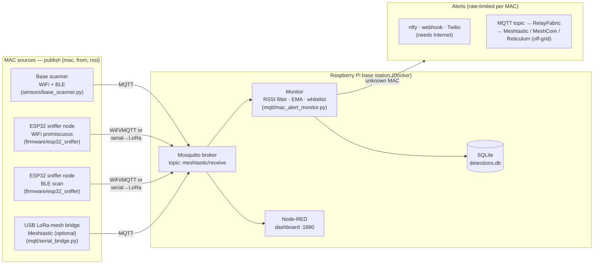

# meshtripwire

Wireless tripwire for remote properties. Distributed sensors detect nearby WiFi/BLE MAC addresses and feed them to a Raspberry Pi base station that filters, logs, and alerts on unknown devices. Everything runs over WiFi/MQTT by default; an optional LoRa mesh (Meshtastic, MeshCore, or Reticulum) extends sensors and alerts off-grid where there's no Internet or WiFi.

Proof of concept, provided as-is. Not affiliated with the Meshtastic, MeshCore, or Reticulum projects.

## Architecture



**Caveats:**
- Any sensor that publishes `{"mac", "from", "rssi"}` JSON to MQTT works (see [Where MACs come from](#where-macs-come-from)). LoRa mesh firmware is only a transport for reaching out-of-range sensors and alerts — the pipeline doesn't depend on it. (Note: stock Meshtastic's Paxcounter module sends only anonymized *counts*, not per-MAC data, so it can't feed the whitelist on its own.)
- Modern phones randomize their MACs. Whitelist fixed devices (cameras, sensors, laptops); treat phone MACs as ephemeral.

## How it works

Sensors scan for nearby MACs and publish sightings to the base station's MQTT broker (out-of-range nodes backhaul over LoRa first; see [Where MACs come from](#where-macs-come-from)). The base station runs Mosquitto and `mqtt/mac_alert_monitor.py`, which:

1. Parses sightings from MQTT (`meshtastic/receive`)
2. Drops signals below the RSSI threshold, smooths the rest with an EMA
3. Checks the MAC against `config/whitelist.txt` (hot-reloaded on file change, no restart needed)
4. Logs every detection to SQLite (`logs/detections.db`), tagged with GPS from the payload or the static per-node coordinates in `config/nodes.json`
5. Alerts on unknown MACs via ntfy.sh, webhook, Twilio SMS, or an MQTT topic, rate-limited per MAC

An optional Node-RED dashboard (`node-red/flows.json`) shows live sightings with a strong-signals-only toggle.

### Where MACs come from

Anything that publishes `{"mac","from","rssi"}` to `meshtastic/receive` is a
sensor. Available sources, in order of effort:

- **Base-station scanner** (`sensors/base_scanner.py`) — sniffs real WiFi/BLE
  MACs on the machine running the broker. No firmware; range limited to the base
  station's radios. `python -m sensors.base_scanner --node base --ble [--wifi wlan1mon]`
- **ESP32 sniffer nodes** (`firmware/esp32_sniffer/`) — dedicated ESP32s doing
  promiscuous WiFi *or* BLE capture (one radio per board), backhauling over
  WiFi/MQTT or serial→LoRa mesh (Meshtastic/MeshCore/Reticulum). Distributed
  coverage. See `firmware/README.md`.
- **USB LoRa-mesh bridge** (`mqtt/serial_bridge.py`) — forwards RF packets a
  locally attached Meshtastic node hears; the "MAC" is the transmitting node's
  radio, so this is a tripwire for people carrying mesh devices, not general
  WiFi/BLE. (Meshtastic-specific today; the JSON contract is transport-neutral.)
- **Custom sensor firmware** — the original vision, scan + LoRa in one node.
  Not provided; would emit the same `{mac, from, rssi}` over any mesh.

### Off-grid sensors (LoRa relay)

For sensors out of WiFi range, an ESP32 sniffer backhauls its sightings over a
LoRa mesh instead of MQTT. End-to-end:

```
ESP32 sniffer ──serial──▶ field mesh node ──LoRa──▶ base mesh node ──USB──▶ base station
 OUTPUT_SERIAL 1          Meshtastic Serial module              serial_bridge.py ─▶ MQTT ─▶ monitor
```

1. **Sniffer** — build `firmware/esp32_sniffer/` with `OUTPUT_SERIAL 1`. It
   prints one compact line per sighting to its UART: `AABBCC112233,-64` (MAC hex,
   no colons, then RSSI) — ~16 bytes vs ~56 for JSON. To save airtime it only
   reports MACs *not* in the on-device `WHITELIST[]`, so your own gear never hits
   the mesh.
2. **Field mesh node** — wire the ESP32's TX to a nearby Meshtastic node's RX
   (shared ground) and enable its Serial module in text mode:
   `meshtastic --set serial.enabled true --set serial.mode TEXTMSG --set serial.baud BAUD_115200`.
   Each line goes out as a LoRa text message. (MeshCore/Reticulum work too — any
   transport that carries the text line.)
3. **Base mesh node** — a Meshtastic node on USB to the Pi receives the messages.
4. **Bridge** — `python -m mqtt.serial_bridge --serial-port /dev/ttyUSB0
   [--sensor-map config/sensor_nodes.json]` parses the compact line, restores the
   MAC, tags it with the sensor name mapped from the relay node id, and republishes
   full JSON to the broker. The monitor treats it like any other sighting, and the
   same bridge still flags node *presence* (see the USB LoRa-mesh bridge above).

The compact format, on-device whitelist, and node→name mapping together cut LoRa
traffic ~10–20× (see the bandwidth notes in `firmware/README.md`). Also keep
`COOLDOWN_MS` high and `RSSI_MIN` tight — MAC randomization can still generate
more sightings than the channel carries.

### Off-grid alerts (RelayFabric)

ntfy, webhook, and Twilio all need the Internet — the opposite of the remote
sites this is built for. Set `EnableMqtt = true` in `[Notifications]` and the
monitor publishes each alert (JSON: `mac`, `node`, `ts`, `message`) to
`MqttAlertTopic` on the same broker. [RelayFabric](https://github.com/RelayFabric/RelayFabric)
subscribes to that topic and relays alerts over a **LoRa mesh — Meshtastic,
MeshCore, or LXMF/Reticulum**, so they reach you with no cellular. See RelayFabric's
`meshtripwire` plugin (formatted alerts) or `examples/meshtripwire.yaml` (relay
with the generic `mqtt` plugin, no extra code).

## Hardware

Nothing here is required all at once — build the base station, then add whichever
sensors fit your site. Prices are rough street prices (mid-2026, USD) for the
cheap-clone tier; brand-name versions cost more. Product links are Amazon
affiliate links (they help fund the project; buy anywhere you like).

| Role | Part | ~Cost | Notes |
|------|------|-------|-------|
| **Base station** | [Raspberry Pi 4 (2GB+)](https://amzn.to/4hT1AlV) | $45–99 | Runs the whole Docker stack. A Pi Zero 2 W (~$15) works for light loads. |
| | microSD 16GB+ | $6 | Or boot from USB/SSD. |
| **Base scanner radios** | USB BLE adapter | $8–12 | Any BlueZ-compatible dongle; many Pis have BLE built in ($0). |
| | [USB WiFi adapter w/ monitor mode](https://amzn.to/46jq68C) | $10–15 | Needs an mac80211 monitor-capable chipset (e.g. RTL8812AU, AR9271). Onboard Pi WiFi usually can't sniff. |
| **WiFi/BLE sniffer node** | [ESP32-C3 SuperMini](https://amzn.to/4gODyHE) | $2–3 | Cheapest sniffer; one radio per board (WiFi *or* BLE). WiFi-range backhaul only. Onboard PCB antenna is often detuned on these clones → shorter range; prefer a board with a u.FL/external antenna if coverage matters. Deploy several. |
| | [ESP32-WROOM-32 DevKitC](https://amzn.to/45GHggp) | $3–5 | Dual-core alternative, no real advantage for sniffing. |
| **Off-grid / LoRa node** (optional) | [Heltec WiFi LoRa 32 V3](https://amzn.to/4gQIko0) | $12–18 | Only for sensors/alerts beyond WiFi range. Runs Meshtastic, MeshCore, or Reticulum. Same board as the reference node. |
| | 868/915 MHz antenna | $2–5 | Match your region's ISM band; never power a LoRa board without one. |
| **Power (per remote node)** | [18650 cell + holder](https://amzn.to/4c9de8z), or USB PSU | $5–15 | Solar + LiPo for true off-grid; a phone charger indoors. |

Minimum viable tripwire: a **Pi with built-in BLE** running the base scanner —
zero extra hardware, real BLE MACs, limited to the Pi's radio range. Add ESP32-C3
sniffers for more WiFi coverage, and a Heltec V3 only when a sensor is beyond WiFi.

Reality check: phone MAC randomization means every tier detects *presence*, not
*identity* — buy for coverage (more cheap nodes), not for a fancier single node.

## Setup

### Docker (recommended)

Runs the full stack: Mosquitto, the monitor, and Node-RED (dashboard on port 1880).

```bash
docker compose up -d --build
```

The monitor reaches the broker via the `MQTT_HOST=mosquitto` env override; `config/` and `logs/` are mounted from the host, so edit config and whitelist in place. The bundled `setup/mosquitto.conf` allows anonymous LAN publishes — add auth/TLS before exposing it further.

### Bare metal (Raspberry Pi)

```bash
bash setup/install_dependencies.sh   # apt packages, venv, Mosquitto, Node-RED
```

Edit `config/config.ini` (broker, thresholds, notification credentials), `config/whitelist.txt` (one MAC per line), and `config/nodes.json` (node ID to GPS mapping). Then, from the project root:

```bash
venv/bin/python -m mqtt.mac_alert_monitor
```

To run as a service, edit the paths/user in `setup/meshtripwire.service`, then:

```bash
sudo cp setup/meshtripwire.service /etc/systemd/system/
sudo systemctl enable --now meshtripwire
```

### Sensors

The base station alone detects nothing — add at least one MAC source.

**Base scanner** (no hardware beyond the Pi's own radios):

```bash
venv/bin/pip install bleak                                  # for --ble; scapy for --wifi
venv/bin/python -m sensors.base_scanner --node base --ble   # add --wifi wlan1mon for WiFi
```

**ESP32 BLE sniffer** (`firmware/esp32_sniffer/`):

1. Install the ESP32 board package in Arduino IDE (or PlatformIO), plus the
   **PubSubClient** library. BLE mode uses the core's built-in `BLEDevice` — no
   extra install.
2. In `esp32_sniffer.ino`, set `#define SCAN_MODE SCAN_BLE`, then edit the config
   block: `WIFI_SSID`/`WIFI_PASS`, `MQTT_HOST`/`MQTT_PORT`, a unique `NODE_ID`,
   and `RSSI_MIN`. Leave `OUTPUT_SERIAL 0` for WiFi→MQTT backhaul.
3. Put the C3 in download mode — hold **BOOT**, tap **RESET**, release BOOT — and
   flash. Power over USB-C only while flashing (don't also feed the 5V pin).
4. Open Serial Monitor at 115200; you'll see published sightings. Confirm they
   land with `docker compose logs -f monitor`.

Deploy WiFi sniffers (`SCAN_MODE SCAN_WIFI`) and BLE sniffers (`SCAN_MODE
SCAN_BLE`) as separate boards — one radio each. Full options, serial→LoRa
backhaul, and reality checks are in [`firmware/README.md`](firmware/README.md).

## Configuration

All settings live in `config/config.ini`:

- `[MQTT]` — broker host/port/topic; optional `Username`/`Password` and `UseTLS`/`CAFile`
- `[Files]` — data file paths; `RetentionDays` prunes old detections (0 = keep forever)
- `[Filtering]` — `RSSIMin` threshold, `EMAlpha` smoothing, `StateTimeoutSeconds`, `AlertCooldownSeconds`, `DwellSeconds`
- `[Sensors]` — `ExpectedSensors`, `SensorTimeoutSeconds`, `HeartbeatTopic` (sensor-offline watchdog)
- `[Arming]` — `Schedule`, `ControlTopic` (when alerts are allowed to fire)
- `[Notifications]` — enable/configure ntfy.sh, webhook, Twilio SMS, and the MQTT alert output (`EnableMqtt`/`MqttAlertTopic`, for off-grid relay via RelayFabric)

### Cutting false alarms

Alerting on *every* unknown MAC is unusable in practice — MAC randomization means
constant strangers. Three gates, all in `config.ini`:

- **Dwell** (`DwellSeconds`) — only alert once a device has *persisted* that long,
  so a car passing the fence is ignored and someone loitering isn't. The single
  biggest false-positive reducer; try 120–300s.
- **Arming** (`[Arming] Schedule = 22:00-06:00`) — only alert during away/asleep
  hours. Or drive it live: publish `armed`/`disarmed`/`auto` to `ControlTopic`
  (e.g. a phone-presence automation disarms while you're home). Because a disarm
  turns off protection, set `ControlSecret` (messages become
  `{"cmd":"disarmed","secret":"..."}`) so a random broker client can't disarm you,
  and a manual override auto-reverts to the schedule after `ControlOverrideTTL`.
- **Sensor watchdog** (`[Sensors] ExpectedSensors = gate,fence`) — alerts if a
  listed sensor goes silent past `SensorTimeoutSeconds`, so a dead node or downed
  mesh link doesn't become a silent blind spot. Sensors count as alive via any
  detection they report or a heartbeat on `HeartbeatTopic` (`base_scanner`
  publishes these automatically).

## Log sync

Back up detections to any cloud storage rclone supports:

```bash
rclone config                                  # one-time remote setup
bash setup/sync_logs.sh gdrive:meshtripwire    # or from cron, e.g. every 30 min
```

## Testing

```bash
venv/bin/python test_smoke.py
```
