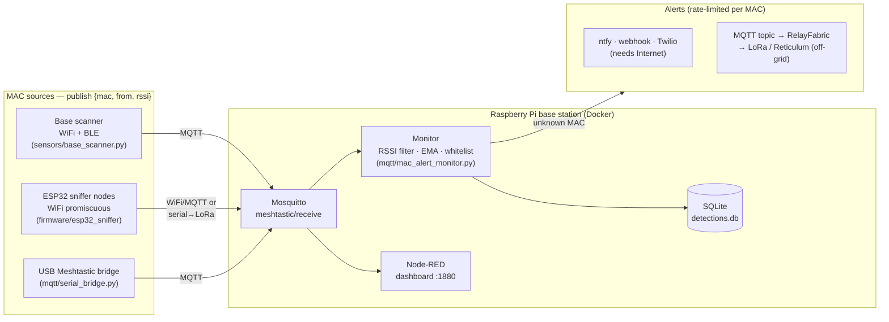

# meshtripwire

Wireless tripwire for remote properties. Distributed sensors detect nearby WiFi/BLE MAC addresses and feed them to a Raspberry Pi base station that filters, logs, and alerts on unknown devices — with off-grid alert delivery over LoRa/Reticulum when there's no Internet.

Not affiliated with the Meshtastic project. Proof of concept, provided as-is.

## Architecture



**Caveats:**
- Any sensor that publishes `{"mac", "from", "rssi"}` JSON to MQTT works (see [Where MACs come from](#where-macs-come-from)). Stock Meshtastic Paxcounter sends only anonymized *counts*, not per-MAC data, so it can't drive the whitelist pipeline on its own.
- Modern phones randomize their MACs. Whitelist fixed devices (cameras, sensors, laptops); treat phone MACs as ephemeral.

## How it works

Sensor nodes scan and forward sightings over LoRa. The base station runs Mosquitto and `mqtt/mac_alert_monitor.py`, which:

1. Parses sightings from MQTT (`meshtastic/receive`)
2. Drops signals below the RSSI threshold, smooths the rest with an EMA
3. Checks the MAC against `config/whitelist.txt` (hot-reloaded on file change, no restart needed)
4. Logs every detection to SQLite (`logs/detections.db`), tagged with GPS from the payload or the static per-node coordinates in `config/nodes.json`
5. Alerts on unknown MACs via ntfy.sh, webhook, Twilio SMS, or an MQTT topic, rate-limited per MAC

An optional Node-RED dashboard (`node-red/flows.json`) shows live sightings with a strong-signals-only toggle.

### Where MACs come from

Anything that publishes `{"mac","from","rssi"}` to `meshtastic/receive` is a
sensor. Available sources, in order of effort:

- **Base-station scanner** (`sensors/base_scanner.py`) — sniffs real WiFi/BLE
  MACs on the machine running the broker. No firmware; range limited to the base
  station's radios. `python -m sensors.base_scanner --node base --ble [--wifi wlan1mon]`
- **ESP32 sniffer nodes** (`firmware/esp32_sniffer/`) — dedicated ESP32s doing
  promiscuous WiFi capture, backhauling over WiFi/MQTT or serial→Meshtastic→LoRa.
  Distributed coverage. See `firmware/README.md`.
- **USB Meshtastic bridge** (`mqtt/serial_bridge.py`) — forwards RF packets a
  locally attached node hears; the "MAC" is the transmitting node's radio, so
  this is a tripwire for people carrying Meshtastic devices, not general WiFi/BLE.
- **Custom Meshtastic firmware** — the original vision (scan + LoRa in one node).
  Not provided; stock firmware's Paxcounter module sends only anonymized counts.

### Off-grid alerts (RelayFabric)

ntfy, webhook, and Twilio all need the Internet — the opposite of the remote
sites this is built for. Set `EnableMqtt = true` in `[Notifications]` and the
monitor publishes each alert (JSON: `mac`, `node`, `ts`, `message`) to
`MqttAlertTopic` on the same broker. [RelayFabric](https://github.com/RelayFabric/RelayFabric)
subscribes to that topic and relays alerts over **LXMF/Reticulum or a
Meshtastic channel**, so they reach you with no cellular. See RelayFabric's
`meshtripwire` plugin (formatted alerts) or `examples/meshtripwire.yaml` (relay
with the generic `mqtt` plugin, no extra code).

## Setup

### Docker (recommended)

Runs the full stack: Mosquitto, the monitor, and Node-RED (dashboard on port 1880).

```bash
docker compose up -d --build
```

The monitor reaches the broker via the `MQTT_HOST=mosquitto` env override; `config/` and `logs/` are mounted from the host, so edit config and whitelist in place. The bundled `setup/mosquitto.conf` allows anonymous LAN publishes — add auth/TLS before exposing it further.

### Bare metal (Raspberry Pi)

```bash
bash setup/install_dependencies.sh   # apt packages, venv, Mosquitto, Node-RED
```

Edit `config/config.ini` (broker, thresholds, notification credentials), `config/whitelist.txt` (one MAC per line), and `config/nodes.json` (node ID to GPS mapping). Then, from the project root:

```bash
venv/bin/python -m mqtt.mac_alert_monitor
```

To run as a service, edit the paths/user in `setup/meshtripwire.service`, then:

```bash
sudo cp setup/meshtripwire.service /etc/systemd/system/
sudo systemctl enable --now meshtripwire
```

## Configuration

All settings live in `config/config.ini`:

- `[MQTT]` — broker host/port/topic; optional `Username`/`Password` and `UseTLS`/`CAFile`
- `[Files]` — data file paths; `RetentionDays` prunes old detections (0 = keep forever)
- `[Filtering]` — `RSSIMin` threshold, `EMAlpha` smoothing, `StateTimeoutSeconds`, `AlertCooldownSeconds`
- `[Notifications]` — enable/configure ntfy.sh, webhook, Twilio SMS, and the MQTT alert output (`EnableMqtt`/`MqttAlertTopic`, for off-grid relay via RelayFabric)

## Log sync

Back up detections to any cloud storage rclone supports:

```bash
rclone config                                  # one-time remote setup
bash setup/sync_logs.sh gdrive:meshtripwire    # or from cron, e.g. every 30 min
```

## Testing

```bash
venv/bin/python test_smoke.py
```
