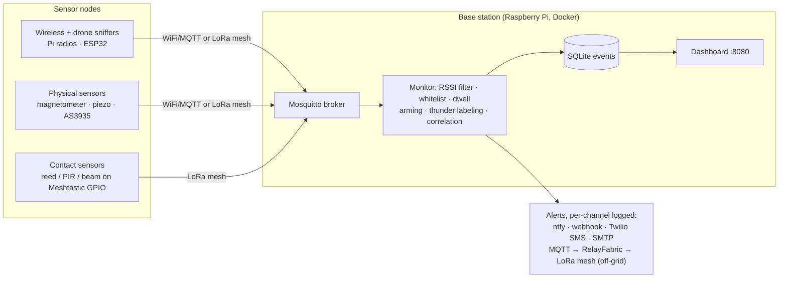
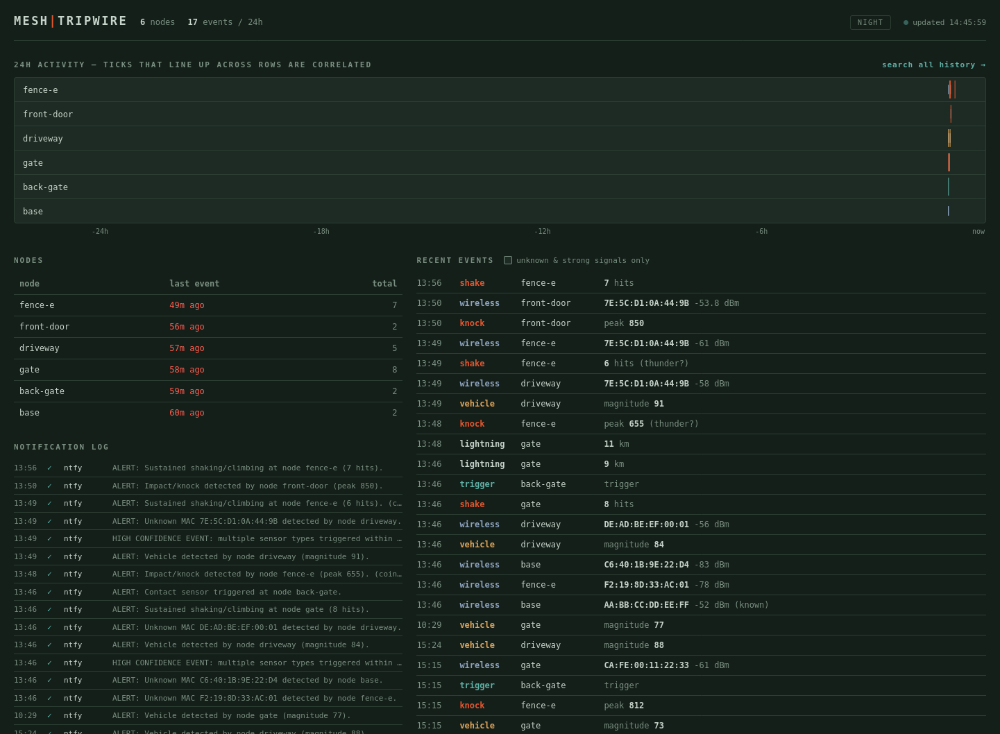

# meshtripwire

Camera-free, cloud-free perimeter security for remote properties. Cheap
distributed sensors detect wireless devices, vehicles, fence vibration, doors,
lightning, and drones, and feed a Raspberry Pi base station that filters,
correlates, logs, and alerts. Everything runs over WiFi/MQTT by default; an
optional LoRa mesh (Meshtastic, MeshCore, or LXMF/Reticulum) extends sensors
and alerts off-grid where there is no Internet or WiFi.

Proof of concept, provided as-is. Not affiliated with the Meshtastic, MeshCore,
or Reticulum projects. Docs: [docs.meshtripwire.org](https://docs.meshtripwire.org/)

## Sensors

Every sensor is a cheap module publishing tiny events; the base station owns
all the logic. Mix whatever fits your site.

| Sensor | Detects | Hardware per node | Source |
|---|---|---|---|
| Wireless presence | WiFi/BLE devices (phones, gear) by MAC | Pi's own radios ($0) or ESP32-C3 ($3) | `sensors/base_scanner.py`, `firmware/esp32_sniffer/` |
| Drone Remote ID | mandated drone ID broadcasts (ASTM F3411) | same sniffer, compile flag | `firmware/esp32_sniffer/` (`DETECT_DRONEID`) |
| Vehicle | magnetic signature within ~2–5 m, no phone aboard needed | ESP32 + QMC5883L magnetometer ($2) | `firmware/qmc5883l_vehicle/` |
| Vibration | door knock vs sustained climbing/shaking; ignores wind | ESP32 + piezo disc (<$1) | `firmware/piezo_vibration/` |
| Contact / motion | reed switch, PIR, IR beam-break, float switch | sensor on a Meshtastic node's GPIO | stock Detection Sensor module, no custom firmware |
| Lightning | strikes to ~40 km; labels storm-window vibration alerts as possible thunder | ESP32 + AS3935 ($8) | `firmware/as3935_lightning/` |
| Mesh-device presence | people carrying LoRa mesh nodes | the base station's USB Meshtastic node | `mqtt/serial_bridge.py` |

Classification happens on the sensor (a knock is distinguished from climbing on
the ESP32 itself), so events are a few bytes and survive a LoRa link. Details,
wiring, and calibration for each: [`firmware/README.md`](firmware/README.md).

## Architecture



**Reality checks:**

- Modern phones randomize their MACs: wireless sensing detects *presence*, not
  identity. Whitelist fixed devices (cameras, sensors, laptops) and lean on the
  dwell filter; the physical sensors cover visitors carrying nothing at all.
- Any device on the LAN or mesh can claim to be a sensor. Harden the broker
  before trusting the data further than your fence line (see Configuration).

## How it works

Sensors publish to one MQTT topic. The monitor (`mqtt/mac_alert_monitor.py`):

1. Normalizes every wire format into one canonical event and logs it to SQLite
   (`events` table), tagged with GPS from the payload or `config/nodes.json`
2. Runs MAC sightings through an RSSI floor, EMA smoothing, the hot-reloaded
   whitelist, and the dwell filter; classified sensor events skip straight to
   alerting with per-type cooldowns
3. Labels vibration events that coincide with lightning as possible thunder
   (they still alert, but can't drive correlation)
4. Escalates when ≥2 distinct sensor types trigger within the correlation
   window: one combined **HIGH CONFIDENCE** alert listing the contributors
5. Dispatches each alert to every enabled channel and records the per-channel
   delivery outcome in a notification log

The built-in dashboard (port 8080) shows a 24h per-node strip chart where
correlated events line up vertically, node health, the notification log, and a
live feed. It is stdlib-only, read-only, mobile-friendly, and has a
red-flashlight night mode. `/history` searches everything ever recorded by
text, type, node, and date range.



## Off-grid backhaul

Sensors beyond WiFi range print compact lines (`AABBCC112233,-64`, `V,84`,
`K,812`) over serial to a mesh radio; a bridge at the base station expands them
back into events. Three stacks are supported:

| Mesh | Field side | Base side |
|---|---|---|
| **Meshtastic** | wire sensor TX to a node's Serial module (`TEXTMSG` mode) | `python -m mqtt.serial_bridge --serial-port /dev/ttyUSB0` |
| **MeshCore** | build with `SERIAL_MESHCORE 1`, wire to a companion node | `python -m mqtt.meshcore_bridge --serial-port /dev/ttyUSB0` |
| **LXMF/Reticulum** | `sensors/rns_field_relay.py` on a small relay host (Pi Zero + RNode) | `python -m mqtt.rns_bridge` |

The compact format, on-device whitelists, and node→name mapping cut LoRa
traffic 10–20×; wiring and bandwidth notes in
[`firmware/README.md`](firmware/README.md).

Alerts leave off-grid the same way: set `EnableMqtt = true` and
[RelayFabric](https://github.com/RelayFabric/RelayFabric) picks alerts off the
broker and carries them over Meshtastic, MeshCore, or LXMF/Reticulum, no
cellular required (see its `meshtripwire` plugin).

## Hardware

Nothing is required all at once: build the base station, then add whichever
sensors fit your site. Rough street prices (mid-2026, USD) for the cheap-clone
tier. Product links are Amazon affiliate links (they help fund the project;
buy anywhere you like).

| Role | Part | ~Cost | Notes |
|------|------|-------|-------|
| **Base station** | [Raspberry Pi 4 (2GB+)](https://amzn.to/4hT1AlV) | $45–99 | Runs the whole Docker stack. A Pi Zero 2 W (~$15) works for light loads. |
| | microSD 16GB+ | $6 | Or boot from USB/SSD. |
| **Base scanner radios** | USB BLE adapter | $8–12 | Any BlueZ-compatible dongle; many Pis have BLE built in ($0). |
| | [USB WiFi adapter w/ monitor mode](https://amzn.to/46jq68C) | $10–15 | Needs a monitor-capable chipset (RTL8812AU, AR9271). Onboard Pi WiFi usually can't sniff. |
| **Sniffer node** | [ESP32-C3 SuperMini](https://amzn.to/4gODyHE) | $2–3 | One radio per board (WiFi *or* BLE); deploy several. Clone PCB antennas are often detuned; prefer u.FL/external if coverage matters. |
| | [ESP32-WROOM-32 DevKitC](https://amzn.to/45GHggp) | $3–5 | Dual-core alternative; no real advantage for sniffing. |
| **Vehicle sensor** | GY-271 (QMC5883L) + any ESP32 above | $2–3 | I2C magnetometer. |
| **Vibration sensor** | Piezo disc (27 mm) + 1 MΩ resistor + any ESP32 | <$1 | Glued to a door, gate, or fence run. |
| **Lightning sensor** | AS3935 module (CJMCU-3935) + any ESP32 | $8–15 | Thunder-labels piezo alerts so storms don't false-alarm. |
| **Contact sensors** | Reed switch, PIR (AM312), IR beam-break, float | $1–8 | Straight onto a Meshtastic node's GPIO. |
| **Off-grid / LoRa node** | [Heltec WiFi LoRa 32 V3](https://amzn.to/4gQIko0) | $12–18 | Only for reach beyond WiFi. Runs Meshtastic or MeshCore. |
| | 868/915 MHz antenna | $2–5 | Match your region's band; never transmit without one. |
| **Power (per remote node)** | [18650 cell + holder](https://amzn.to/4c9de8z), or USB PSU | $5–15 | Solar + LiPo for true off-grid. |

Minimum viable tripwire: a Pi with built-in BLE running the base scanner. Add
ESP32 sniffers for coverage, physical sensors for the approaches that matter,
and a LoRa node only when something sits beyond WiFi. Buy for coverage (more
cheap nodes), not for a fancier single node.

## Setup

### Docker (recommended)

Runs the full stack: Mosquitto, the monitor, and the dashboard (port 8080).

```bash
docker compose up -d --build
```

`config/` and `logs/` are mounted from the host, so edit config and whitelist
in place. The bundled `setup/mosquitto.conf` allows anonymous LAN publishes so
sensors work out of the box; add broker auth/TLS before trusting it further.

### Bare metal (Raspberry Pi)

```bash
bash setup/install_dependencies.sh   # apt packages, venv, Mosquitto
venv/bin/python -m mqtt.mac_alert_monitor
venv/bin/python -m dashboard.server  # dashboard on :8080
```

To run as a service, edit paths in `setup/meshtripwire.service`, then
`sudo cp setup/meshtripwire.service /etc/systemd/system/ && sudo systemctl enable --now meshtripwire`.

### First sensor

The base station alone detects nothing. Fastest start, no extra hardware:

```bash
venv/bin/pip install bleak
venv/bin/python -m sensors.base_scanner --node base --ble
```

Then flash ESP32 nodes per [`firmware/README.md`](firmware/README.md): pick
the sketch, edit its config block (WiFi/MQTT or serial backhaul, node id,
calibration knobs), flash, and watch `docker compose logs -f monitor` for
arrivals.

## Configuration

All settings live in `config/config.ini`:

- `[MQTT]`: broker host/port/topic, optional auth and TLS
- `[Files]`: data paths; `RetentionDays` prunes old data (0 = keep forever)
- `[Filtering]`: RSSI floor, EMA smoothing, dwell, per-sensor-type alert
  cooldowns, `LightningLabelSeconds`
- `[Sensors]`: the sensor-offline watchdog (`ExpectedSensors`, timeout, heartbeats)
- `[Arming]`: schedule, MQTT arm/disarm control, control secret, override TTL
- `[Correlation]`: distinct-type threshold, window, combined-alert cooldown
- `[Notifications]`: ntfy.sh, webhook, Twilio SMS, SMTP (direct or via
  SES/Gmail-style relays), and the MQTT alert output for RelayFabric

Full key-by-key reference: [docs.meshtripwire.org/configuration](https://docs.meshtripwire.org/configuration/)

### Cutting false alarms

Alerting on every unknown MAC is unusable in practice; MAC randomization means
constant strangers. The gates, all in `config.ini`:

- **Dwell** (`DwellSeconds`): only alert once a device has *persisted*, so a
  passing car is ignored and someone loitering isn't. The single biggest
  false-positive reducer; try 120–300 s.
- **Arming** (`Schedule = 22:00-06:00`, or live over `ControlTopic`): only
  alert during away/asleep hours. Set `ControlSecret` so a random broker client
  can't disarm you; overrides auto-revert after `ControlOverrideTTL`.
- **Thunder labeling**: after an AS3935 strike, vibration alerts are labeled
  as possible thunder and kept out of correlation, so storms don't escalate.
- **Sensor watchdog** (`ExpectedSensors = gate,fence`): alerts when a listed
  sensor goes silent, so a dead node never becomes a silent blind spot.

## Log sync

Back up the database to any cloud storage rclone supports:

```bash
rclone config                                  # one-time remote setup
bash setup/sync_logs.sh gdrive:meshtripwire    # or from cron
```

## Testing

```bash
venv/bin/python test_smoke.py                # monitor pipeline end to end
venv/bin/python -m mqtt.test_events          # plus per-module suites:
venv/bin/python -m mqtt.test_serial_bridge   # bridges, events, dashboard
venv/bin/python -m mqtt.test_meshcore_bridge
venv/bin/python -m mqtt.test_rns_bridge
venv/bin/python -m dashboard.test_server
```

## License

Apache-2.0 · Copyright 2026 Jascha Wanger / Tarnover, LLC · Sponsored by [Tarnover](https://tarnover.com)
