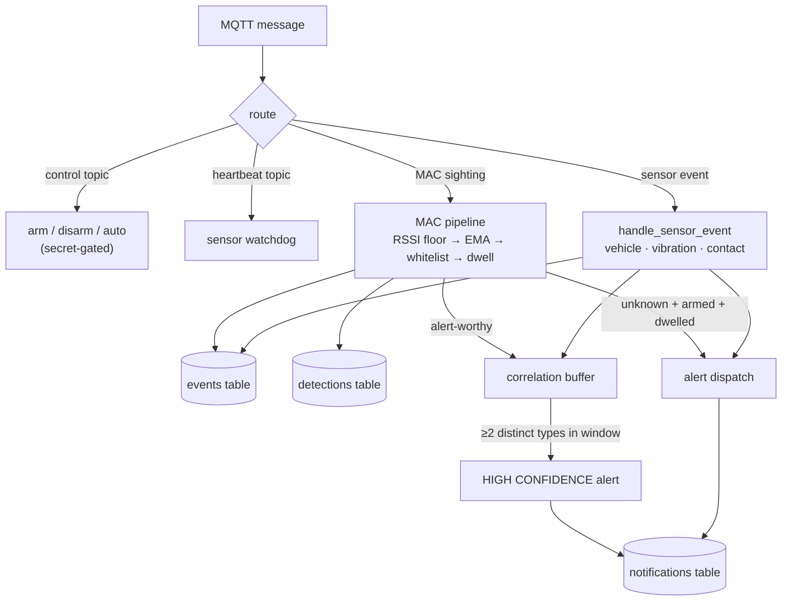

# Architecture

One broker, one monitor process, one SQLite file, one read-only dashboard.
Everything a sensor publishes arrives on a single MQTT topic
(`meshtastic/receive` by default); the monitor routes it, classifies it,
stores it, and decides whether it alerts.

## The pipeline



## Canonical events (v0.2)

Every accepted wire format is normalized at ingest into one canonical dict;
storage, correlation, and alerting consume only canonical events, so deployed
sensors never need reflashing when the backend evolves:

```python
{
  "type":   "vibration",        # vehicle | vibration | contact | wireless_presence
  "node":   "fence-e",
  "sensor": "piezo",
  "event":  "shake",            # detected | knock | shake | trigger | ...
  "value":  9,                  # peak / hits / magnitude (type-dependent)
  "ts":     "<iso8601 utc>",
  "meta":   {"mac": ..., "rssi": ...}   # extras ride here
}
```

Accepted wire formats, all handled by `mqtt/events.py`:

| Wire format | Source | Normalized to |
|---|---|---|
| `{"v":1,"type":...,"node":...}` | bridges, future sensors | as-is; unknown keys → `meta` |
| `{"event":"knock","from":...,"peak":N}` | sensor firmware over WiFi/MQTT | `vibration/knock` etc. |
| `{"mac","from","rssi"}` | all MAC sources | `wireless_presence`, **after** the MAC pipeline |
| Compact lines `V,123` `K,812` `S,9` `AABBCC112233,-64` | LoRa relay | expanded by the bridges |
| Detection Sensor mesh packets | stock Meshtastic | `contact/trigger` |

The type registry (`TYPE_REGISTRY`) maps each `(type, event)` to its alert
text, cooldown config key, and alertability. Adding a sensor type is adding a
row.

## The MAC pipeline

MAC sightings get extra treatment before they become events, because phones
randomize MACs and radio is noisy:

1. **RSSI floor** (`RSSIMin`) drops far-away chatter
2. **EMA smoothing** (`EMAlpha`) stabilizes flapping signal strength
3. **Whitelist** (`config/whitelist.txt`, hot-reloaded) marks known gear
4. **Dwell** (`DwellSeconds`) separates a passer-by from someone loitering

## Storage

`logs/detections.db` (SQLite) holds three tables:

- **`detections`**: the original MAC log: `mac, node, rssi, timestamp, lat, lon`
- **`events`**: every canonical event, MAC and non-MAC alike:
  `ts, node, type, sensor, event, value, lat, lon, meta(JSON)`. Pre-v0.2
  detections are backfilled in once, so history search reaches all the way back.
- **`notifications`**: one row per alert delivery attempt per channel:
  `ts, channel, target, ok, error, message`

All three are pruned by `[Files] RetentionDays` (0 = keep forever). Writes are
committed at least every 5 seconds so the dashboard stays fresh.

## Correlation

A rolling buffer records recent *alertable* events: ones that passed
armed/whitelist/dwell checks, even if their own per-type cooldown muted the
notification. When events from at least `CorrelationMinTypes` **distinct
types** land within `CorrelationWindowSeconds`, one combined HIGH CONFIDENCE
alert lists the contributors. Individual alerts are never held back;
correlation is pure escalation. See [Configuration](configuration.md).
