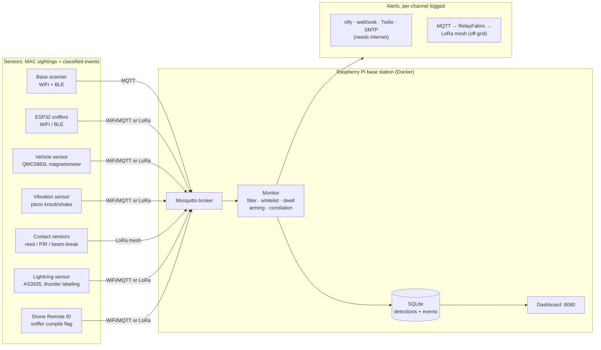

# meshtripwire

**Camera-free, cloud-free perimeter security for remote properties.** Cheap
distributed sensors (WiFi/BLE and drone Remote ID sniffers, a magnetometer on
the driveway, piezo discs on the fence, reed switches on the gates, a
lightning sensor for storm context) feed a Raspberry Pi base station that
filters, classifies, correlates, logs, and alerts. Everything runs
over WiFi/MQTT by default; an optional LoRa mesh (Meshtastic or LXMF/Reticulum)
extends sensors and alerts off-grid where there is no Internet or WiFi.

Proof of concept, provided as-is. Not affiliated with the Meshtastic, MeshCore,
or Reticulum projects.

## Why it exists

Commercial security systems assume cellular coverage, cloud subscriptions, and
mains power. A remote cabin, ranch gate, or trailhead has none of those.
meshtripwire's answer:

- **Sensors cost pennies to a few dollars**: a $0.30 piezo disc, a $2
  magnetometer, a $3 ESP32, so you buy *coverage*, not one fancy device.
- **Classification happens on the sensor**: a knock is distinguished from
  climbing on the ESP32 itself, so a LoRa link carrying a few bytes per event
  is enough backhaul.
- **The base station owns all state**: MQTT in, SQLite storage, correlation
  and alerting logic in one Python monitor, a read-only dashboard out.
- **No Internet required end to end**: sensors reach the base over LoRa, and
  alerts leave over LoRa via [RelayFabric](https://github.com/RelayFabric/RelayFabric).

## Feature status

Validation states are honest: *field-tested* means real hardware in real air,
*bench-tested* means real hardware on a desk, *mock-tested* means the logic is
unit-tested against the documented protocol but has not touched hardware.

| Subsystem | Status | Validation |
|---|---|---|
| MAC pipeline (RSSI filter, EMA, whitelist, dwell) | shipped | unit + smoke suites; live stack |
| ESP32 BLE sniffer | shipped | **bench-tested** on ESP32-C3 SuperMini, live BLE captures |
| ESP32 WiFi sniffer | shipped | compile-verified; same code path as BLE |
| Vehicle sensor (QMC5883L) | shipped | compile-verified; awaiting bench calibration |
| Vibration sensor (piezo knock/shake) | shipped | compile-verified; awaiting bench calibration |
| Contact sensors via Meshtastic Detection Sensor module | shipped | mock-tested against the documented module behavior |
| Lightning sensor (AS3935) + thunder labeling | shipped | labeling unit-tested; firmware compile-verified, awaiting hardware |
| Drone Remote ID detection (sniffer compile flag) | shipped | pipeline unit-tested; frame parsing compile-verified, awaiting a live Remote ID broadcast |
| RF-attack detection (deauth, rogue AP, silence) | shipped | pipeline unit-tested; frame logic compile-verified, awaiting live attack traffic |
| BLE tracker detection | shipped | pipeline unit-tested; advertisement matching compile-verified |
| Asset departure, casing, mass blackout, dark vehicle | shipped | unit-tested monitor logic |
| Glass-break classification (piezo) | shipped | pipeline unit-tested; classifier compile-verified, awaiting a sacrificial jar |
| Canonical event schema + events table | shipped | unit + smoke suites |
| Cross-sensor correlation (HIGH CONFIDENCE alerts) | shipped | unit + smoke suites |
| Alert channels: ntfy, webhook, Twilio, MQTT | shipped | live (ntfy, MQTT); mock-tested (webhook, Twilio) |
| SMTP relay channel (SES/Gmail/Mailgun-style) | shipped | mock-tested at the smtplib call level |
| Notification delivery log | shipped | unit + smoke suites; live stack |
| Dashboard + history search + night mode | shipped | live stack, screenshot-verified, mobile pass |
| Meshtastic serial→LoRa backhaul | shipped | bridge unit-tested; serial path bench-tested |
| LXMF/Reticulum backhaul | shipped | **live-tested** over a real RNS network (LXMF delivery through the bridge to a dispatched alert); RNode radio-only path pending a second radio |
| MeshCore backhaul | shipped | mock-tested; **hardware validation pending** |

## Where to start

- [Getting Started](getting-started.md): base station up in ten minutes
- [Sensors](sensors.md): what can feed the tripwire, cheapest first
- [Hardware](hardware.md): the bill of materials
- [Off-Grid Backhaul](off-grid.md): when the sensor is beyond WiFi
